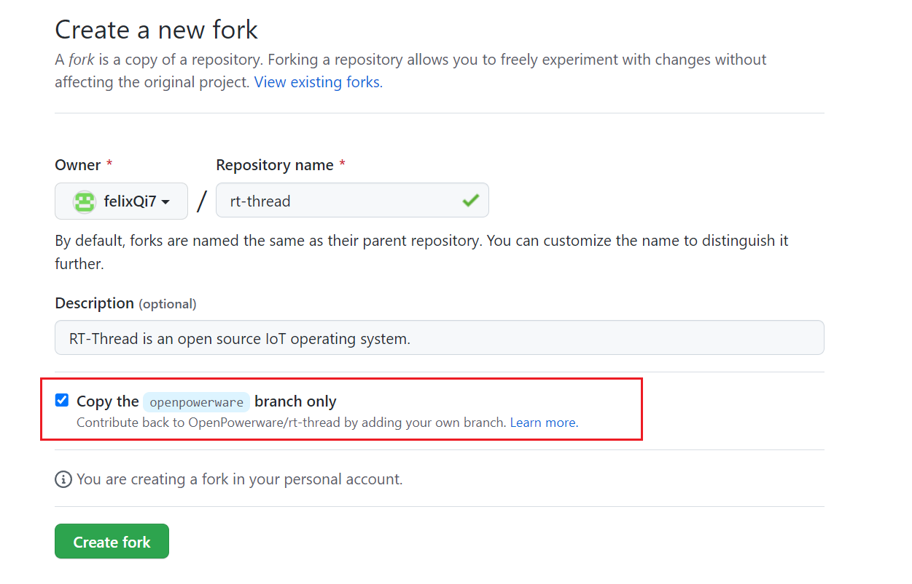
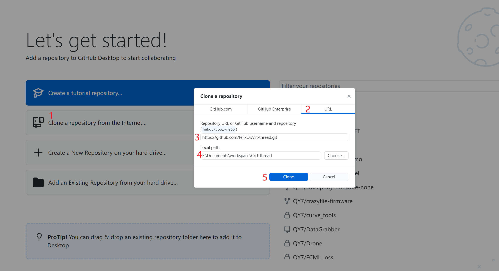
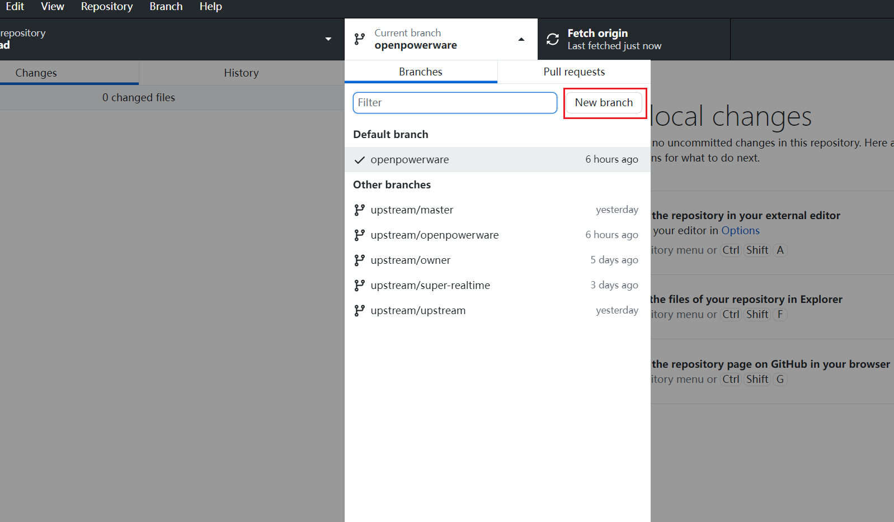
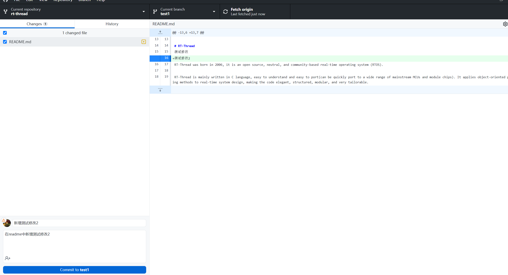
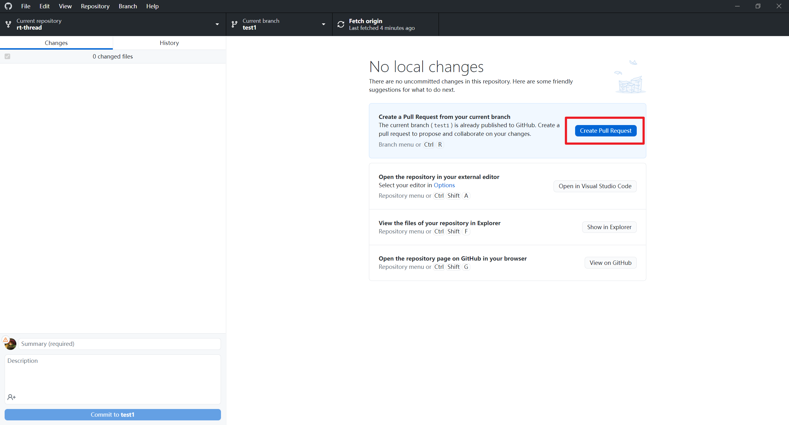
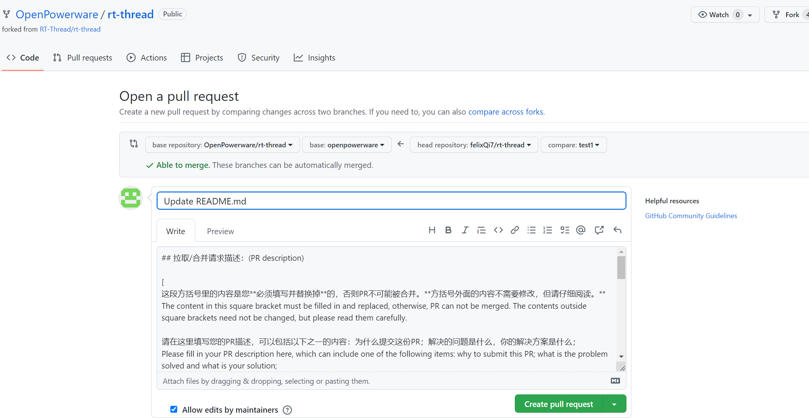
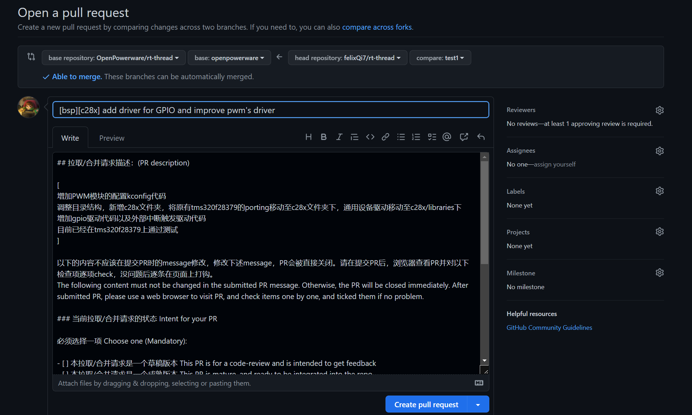
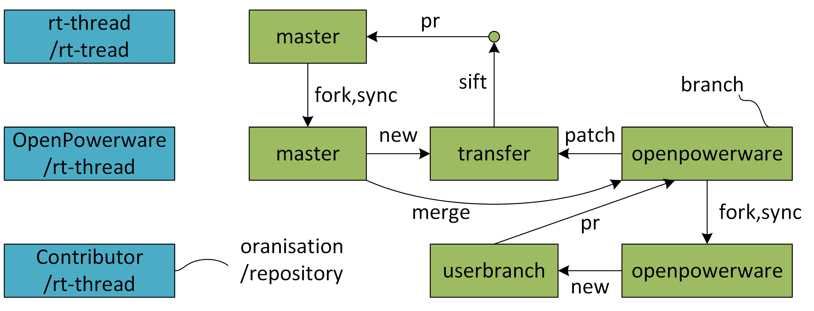

# OpenPowerware RT-thread 开发者指南

# 前期准备

- [ ]  注册github账号
- [ ]  下载git客户端，参考[https://www.cnblogs.com/xueweisuoyong/p/11914045.html](https://www.cnblogs.com/xueweisuoyong/p/11914045.html)
- [ ]  安装github客户端，[https://desktop.github.com/](https://desktop.github.com/)

# fork仓库

首先上github网站，登录自己注册的账号，然后进入以下链接

[https://github.com/OpenPowerware/rt-thread](https://github.com/OpenPowerware/rt-thread)

点击右上角fork，fork我们的仓库，如下图所示。

注意勾选copy the openpowerware branch only（其余分支是管理员分支，不需要fork）。随后点击create fork。这里对我们仓库的分支作以下说明：

<aside>
💡 目前我们的仓库共有两个主要的branch，分别是
1. openpowerware，默认分支，用于开发者提交pr的分支
2. master，不可pr，仅用于与rt-thread主仓同步

</aside>

大家在fork的时候只fork默认的分支(openpowerware)就好，其他的分支由管理员维护。

熟悉git的同学已经不用看后面的教程了，直接开搞。对于不熟悉git操作的同学，请看下面的步骤。

# 本地开发步骤

## 1. clone仓库到本地

在fork好之后就能在自己的主页看到rt-thread的仓库了，比如我以账户名为felixQi7举例。此时就能看到如下所示的仓库，点击Code，再点击2所在位置处的复制图标，这个url之后的步骤会用到。

打开github desktop客户端，登录自己的账号之后，按照下图操作。

1. 点击Clone a repository from the Internet
2. 点击URL
3. 粘贴刚刚复制的网址
4. 选择合适的路径，用来存放仓库的本地代码
5. 点击clone

等待片刻，代码自动下载到本地，可以进行下一步操作。

## 2. 创建自己的branch并开发

注意一定不要在Openpowerware这个branch开发，会导致sync问题。如下图所示，点击new branch，然后填入开发分支的名字（起一个有意义的名字，比如写adc驱动，名字就写adc-driver之类的名字），点击create branch即可

此时你可以按照功能需求开发相应的代码了。注意可以在每一次相对独立的修改之后就可以提交一次本地的commit，并写好title和Description，对修改的内容进行说明。

如下图所示，我修改了readme.md文件，修改完之后进行commit，同时注意写好对应的comment，如下图所示。

commit之后可以推送到自己的远程仓库，在右上角点击push即可。

## 3. 正式pr

当本地的文件修改完毕之后，测试通过之后并且推送到自己的远程仓库之后，就可以创建PR（Pull-request）。点击如下图所示的位置Create Pull Request。

随后会弹出pr提交网页，如下图所示。

在pr中需要详细地写明进行了哪些修改，并是否通过了测试。可以参考的pr模板为

然后点击create pull request。随后管理员会审阅代码，如果代码没有问题，pr将被merge到仓库，否则将被要求继续修改。

**有几点需要注意（敲黑板）：**

**（1）pr只能从自己的branch发起，pr到openpowerware，即 userbranch → openpowerware。这里的userbranch不能与系统的branch（master，openpowerware）重名，否则merge的时候会出问题。**

**（2）openpowerware fork到自己的仓之后，可以用github网页上的sync功能与源仓同步。openpowerware这个branch即使在自己的仓也不能自己修改，否则sync的时候会出现冲突。**

**（3）PR通过之后，需要把发起PR的branch删除。以后有其他的PR，需要首先将openpowerware与主仓同步(使用github网站上的sync功能)，然后从openpowerware新建一个branch，在branch上修改并PR，这样可以使所有改动的历史顺序清晰，否则merge的时候会有conflict。**

**（4）pr前需要在硬件上完成测试，并遵从rt-thread的[代码规范](https://github.com/OpenPowerware/rt-thread/blob/openpowerware/documentation/contribution_guide/coding_style_cn.md)。
可以用这个[formatting tool](https://github.com/mysterywolf/formatting)来自动格式化。注意只需要format改动的代码文件，没有改动的文件不需要formmat，否则会导致copyright栏的时间出错。**

**（5）以上git操作均基于linux系统。如果你使用linux，请直接用git命令行操作。**

好了，以上就是整个pr流程了。

## 4. 写给管理员

下面这个部分是写给OpenPowerware这个组织的管理员的，非管理员可以不用看。目前这个组织由齐雨（@QY7）和顾云杰（@CuttySark1869）管理，今后我们也会吸纳更多的管理员。

OpenPowerware旨在开发针对电力电子控制的软件生态，目前是基于rt-thread，今后会考虑支持其他的RTOS比如freeRTOS。电力电子控制相比大多数嵌入式应用有非常特殊的地方，因此我们对RTOS的一些修改可能不会merge到主仓，但是我们又希望能够跟主仓尽量的同步以充分利用RTOS的生态。因此我们设计了上述三个branch的结构，其相互关系如下图所示。

master是rt-thread主仓的影子，负责和主仓同步。openpowerware是我们自己的主branch，负责接收pr。transfer是一个临时的branch，将openpowerware中适合合并到主仓的代码筛选(sift)出来，并由此向主仓PR。具体的操作方式为：(i)从master新建分支transfer；(ii)比较openpowerware和master生成patch，并将patch应用于transfer；(iii)在transfer中删除不适合向主仓pr的文件，并commit；(iv)从transfer向主仓提出PR。向主仓的PR通过之后，需要把transfer删除，之后有PR再新建。transfer也可以使用不同的名字，由管理员自行决定。

总结一下，管理员的任务有三：

（1）定期同步master并把更新merge进openpowerware。

（2）review pr，通过或者提出修改意见。

（3）定期检查openpowerware，如果发现其中适合合并进rt-thread主仓的修改，则通过transfer向rt-thread主仓的master提出pr。

（4）维护一个.gitignore列表，其中记录openpowerware中不适合向主仓同步的文件和目录，以指导sift。这个列表保存在documents仓rt-thread/sift目录下，需要的时候复制到transfer的.gitignore以筛除不需要commit的文件。注意所有不适合同步到主仓的代码需要写在单独的文件里，不要跟主仓本身的文件混在一起。
